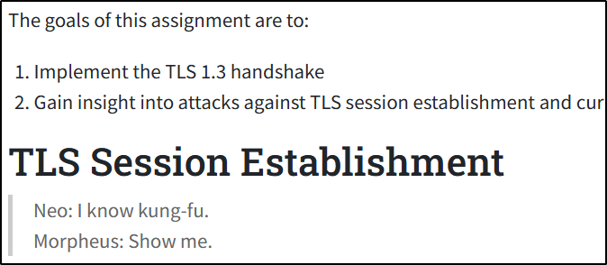

# TLS 1.3 handshake

Tool to understand TLS 1.3 handshake through practical work.A practical example to learn how TLS 1.3 handshake works.

- This is a partial implementation that works only for AES_128_GCM_256 (modify it so that it works for google.com)
- Implement it on your own to understand how the handshake works and use this code for the boring or repetitive parts.
- The conceptual part is explained on my blog but a better source would be: [tls13.xargs.org](https://tls13.xargs.org/)

So, why bother with this when we can always learn from great sources like: [tls13.xargs.org](https://tls13.xargs.org/) or go with the documentation from [TLS 1.3](https://datatracker.ietf.org/doc/html/rfc8446#section-4) handshake IETF](https://datatracker.ietf.org/doc/html/rfc8446#section-4)?

I have this awesome professor [William K Robertson](wkr.io), and he quoted this from The Matrix:



And so, it started... (This is a more complete version that lists the steps involved in the handshake.)

## Usage:

### Docker installation:

Navigate to the tls13_handshake directory (containing the Dockerfile)

```bash
docker build -t tls13_handshake .
docker run -it --rm tls13_handshake <site/ip>:<port>
```

### Python:

You can run the client.py file to achieve the same:

```bash
python3 client.py example.com:443
```
